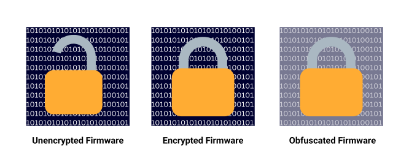
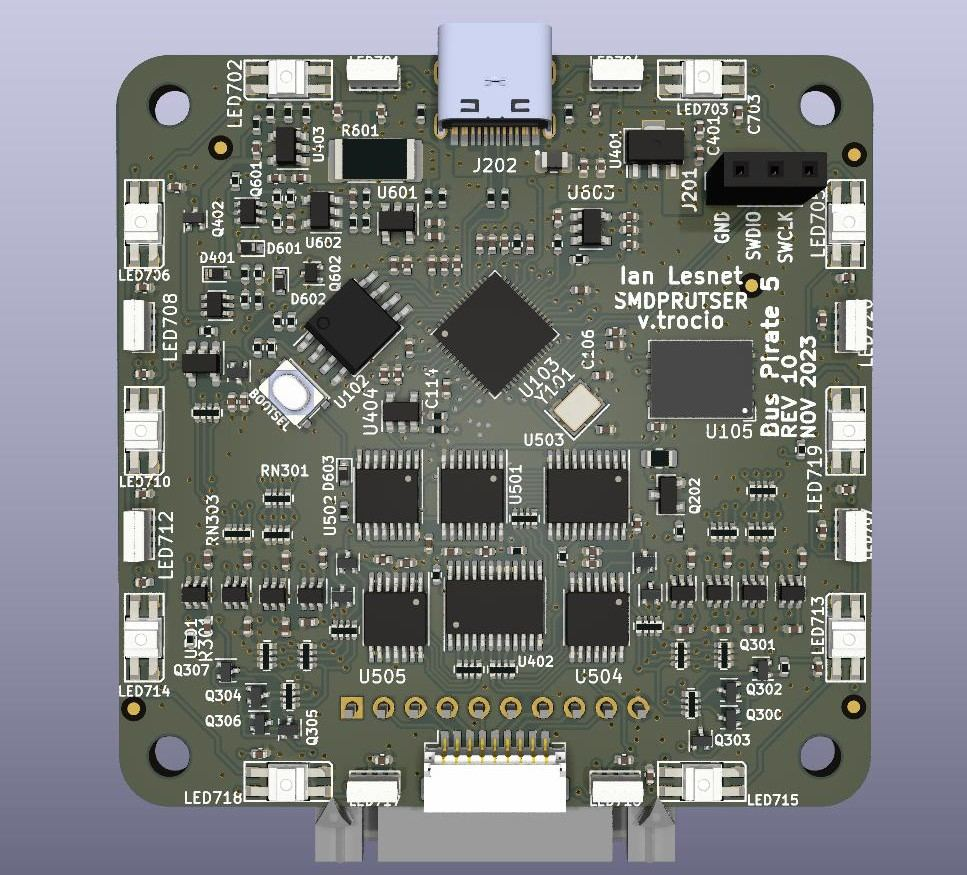
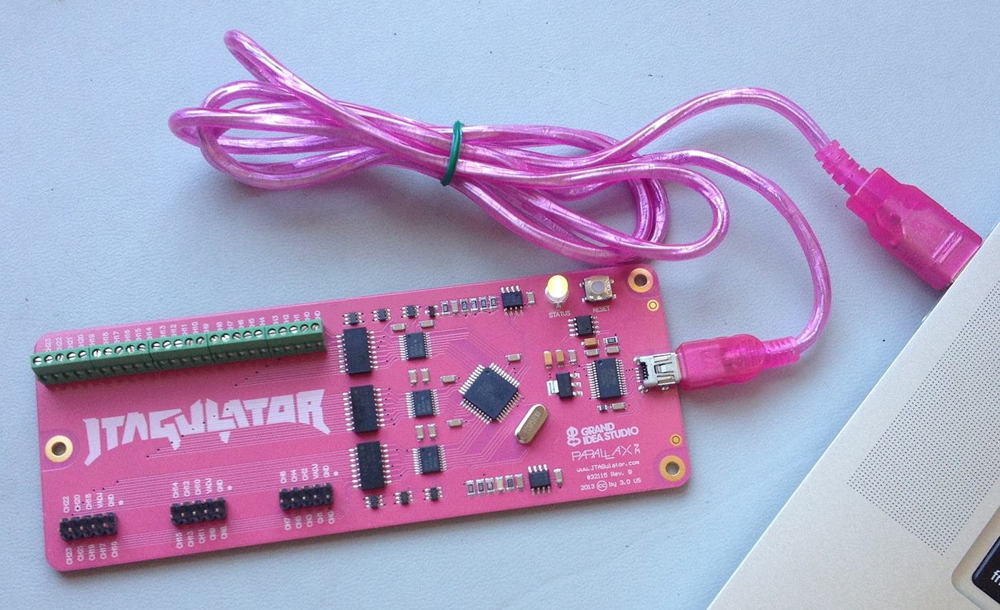
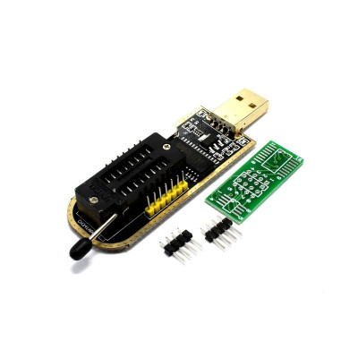

+++
title = 'Extracting IoT Firmware: Tools and Techniques'
date = 2024-09-03T18:18:35+05:30
draft = false 

tags = ["Firmware", "Firmware Analysis", "Reverse Engineering", "Cybersecurity", "IoT", "IoT hacking", "Binary Analysis", "Hardware hacking"] 

summary="Learn what is firmware extraction, the tools and techniques used for extracting firmware & importance of firmware extraction in IoT Hacking."
description = "In this blog, We will be discussing the basics of firmware extraction, the tools and techniques used for extracting firmware, and the importance of firmware extraction in IoT Hacking."
canonicalURL = "https://cybervarun.pages.dev/posts/extracting-iot-firmware/" 

[editPost]
URL = "https://github.com/CyberVarun/Blogs/blob/main/content"
Text = "Suggest Changes"
appendFilePath = true
+++

## Introduction

Hello there! Ever wondered how hackers get into IoT devices? One of the most common techniques used by hackers to hack into IoT devices is to extract the device's firmware. So, in this blog, we'll be discussing the basics of firmware extraction, the tools and techniques used for extracting firmware from various devices, and the importance of firmware extraction in IoT hacking. 

## What is Firmware?

Before we begin learning how to do firmware extraction, first we need to understand what firmware is. **Firmware** is software which is embedded into hardware devices to control the device's function. Firmware is a type of software that is stored in non-volatile memory devices such as ROM, EPROM, or flash memory. It can be found in smart bulbs, smart TVs, CCTVs, smartwatches, etc. 

## Types of Firmware

There are 3 types of firmware:

### 1. Unencrypted Firmware:

The firmware which is not protected by any encryption is called unencrypted firmware. It is easy to extract and analyze unencrypted firmware. Ex: Routers, CCTVs, etc.

### 2. Encrypted Firmware:

The firmware which is protected by encryption is called encrypted firmware. It is difficult to extract and analyze encrypted firmware. Ex: Industrial IoT devies, Automobile systems, etc.

### 3. Obfuscated Firmware:

The firmware which is protected by obfuscation is called obfuscated firmware. Obfuscation is a technique used to make the firmware difficult to understand by renaming variables, functions, etc. It is difficult to extract and analyze obfuscated firmware. 

## What is Firmware Extraction?

Now that we have basic understanding of what firmware is, let's learn what is firmware extraction. **Firmware Extraction** is the process of extracting the software code from the hardware device. It is essential to extract the firmware from the device to analyze the firmware for vulnerabilities, backdoors, hardcoded credentials, etc. 

## Techniques used for extracting firmware

### Hardware-Based Techniques:

1. **JTAG (Joint Test Action Group)**:

    JTAG is a standard for testing and verifying the hardware devices. It is used to test the hardware devices for any faults. JTAG can be used to extract the firmware from the device.

2. **UART (Universal Asynchronous Receiver-Transmitter)**:

    UART is a communication protocol used for serial communication between the device and the computer. It is used to communicate with the device in order to execute commands and give instructions to the device. We can give specific commands to the device to extract the firmware from it.

3. Chip-off Technique:

    In this we actually remove the physical flash memory chip from the device and read the firmware from the chip using a flash programmer. This technique is used when the firmware is encrypted or obfuscated.

### Software-Based Techniques:

- **Firmware Update Mechanism**:

    The firmware update mechanism is a process of updating the firmware of the device. It is used to update the firmware of the device to the latest version. We can analyze the firmware update mechanism to extract the firmware from the device.

**Note**: There are many other techniques available for extracting firmware. These are the most commonly used techniques.

## Tools used for extracting firmware

### Hardware-Based Tools:

1. **Bus Pirate**:

    Bus Pirate is a universal bus interface that can communicate with various devices using different communication protocols such as SPI, I2C, UART, etc. It can be used to extract the firmware from the device. 

2. **JTAGulator**:

    JTAGulator is a tool used to identify the JTAG pins on the device. It is used to identify the JTAG pins on the device. However, hackers can use this tool to extract the firmware from the device. 

3. **Flash Programmer**:

    Flash Programmer is a tool used to read and write the firmware from the flash memory chip. It is used to read the firmware from the flash memory chip using the chip-off technique.

### Software-Based Tools:

1. **Binwalk**:

    Binwalk is a tool used for analyzing, reverse engineering, and extracting firmware images. It is used to extract the firmware from the device.

2. **FirmwareSplitter**:

    A tool that can extract sections and partitions from firmware images. It can handle large files, such as 16 GB full firmware dumps.

3. **Logic Analyzer**:

    A logic analyzer is a tool used to capture and analyze the digital signals in the device. It is used to analyze the digital signals in the device to extract the firmware. It is software as well as hardware based tool.
   
**Note**: This is not full list of tools. There are many other tools available for extracting firmware.

## Firmware Analysis

After extracting the firmware from the device, the next step is to analyze the firmware. The analysis can be one the following methods:

1. **Static Analysis**:

    Static analysis is the process of analyzing the firmware without executing the firmware. This includes analyzing the binary code of the firmware, identifying the functions, variables, etc. 

2. **Dynamic Analysis**:

    Dynamic analysis is the process of analyzing the firmware by executing the firmware in a controlled environment. This includes analyzing the firmware by executing it on the device and monitoring the behavior of the firmware. 

3. **Run-time Analysis**:

    Run-time analysis is the process of analyzing the firmware by executing the firmware on the device. The key difference between dynamic analysis and run-time analysis is that dynamic analysis is done in a controlled environment, whereas run-time analysis is done on the actual device.

## Importance of Firmware Extraction in IoT Hacking

- To analyze the firmware for vulnerabilities, backdoors, hardcoded credentials, etc.
- To understand the working of the device.
- Discover communication protocols used by the device.
- Find the encryption algorithms used by the device.
- Find how the firmware update mechanism works.

## Impacts of Firmware Extraction

- Unauthorized access to the device.
- Stealing sensitive information from the device.
- Manipulating the device's functionality.
- Bricking the device.
- Steal device software to create a clone of the device.

## Conclusion

In this blog, we discussed the basics of firmware extraction, the tools and techniques used for extracting firmware, and the importance of firmware extraction in IoT hacking. Firmware extraction is an essential step in IoT hacking as it helps to analyze the firmware for vulnerabilities. I hope you found this blog informative. If you have any  questions or recommendations, please leave a comment below. Happy hacking!
