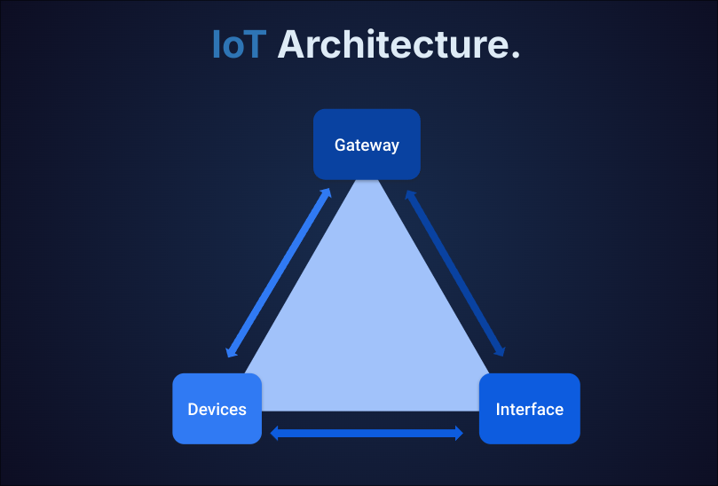

+++
title = 'Getting Started in IoT Hacking - Part 1'
date = 2024-08-28T13:39:32+05:30
draft = false 

tags = ["Cybersecurity", "IoT", "IoT hacking", "Hardware hacking"] 

summary = "In this blog, We will discuss about IoT hacking and how to get started in IoT hacking."
description = "In this blog, I will share my knowledge about IoT hacking and how to get started in IoT hacking."
canonicalURL = "https://cybervarun.pages.dev/posts/getting-started-in-iot-hacking/" 

[cover] 
image = "iot-hacking.png" 
alt = "IoT Hacking Image"
caption = "IoT Hacking Image" 
relative = false

[editPost]
URL = "https://github.com/CyberVarun/Blogs/content"
Text = "Suggest Changes"
appendFilePath = true
+++

## Introduction

Hello there! I am Varun, and I have been working as an IoT security researcher for more than two years now. In this blog, I will share my knowledge about IoT hacking and how to get started in IoT hacking.

## What is IoT?

So, first and foremost, let’s understand what IoT is. IoT stands for Internet of Things. Any devices, referred as a "Smart Device" can be considered an IoT device. These devices can be anything like smart bulbs, smart cameras, smart locks, smart watches, smart cars, smart refrigerators, smart TVs, etc. These devices are connected to the internet and can be controlled remotely. Lets understand this by IoT architecture.

As you can see in the image, the IoT architecture consists of three main components:
- **Devices**: These are the IoT devices that are connected to the internet.
- **Gateway**: This is the device that connects the IoT devices to the internet.
- **Interface**: This is the interface that allows the user to control the IoT devices.

So that was a brief introduction to IoT. Now let's move on to IoT hacking.

## Why IoT Hacking?

Before we get into what is IoT hacking, let's understand why we need to hack IoT devices. The primary reason for hacking IoT devices is to find vulnerabilities in them. These vulnerabilities can be exploited by attackers to gain unauthorized access of the device. This can lead to serious problems, such as data theft, privacy violations, and even physical harm. To safeguard IoT devices from such attacks, it is important to identify and fix vulnerabilities in them. This is where IoT hacking comes in. 

## What is IoT Hacking?

Now that we know why we need to hack IoT devices, let's understand what IoT hacking is. IoT hacking is the process of finding and exploiting vulnerabilities in IoT devices in order to improve their security. This includes finding vulnerabilities in the software and hardware of the devices, as well as in the communication protocols used by the devices. 

## How to get started in IoT Hacking?

Here is the detailed step by step guide on how to get started in IoT hacking:

1. **Learn the Basics of IoT:**

    The first step to getting started in IoT hacking is to learn the basics of IoT. This includes understanding what IoT is, how it works, and what are the different components of IoT. You can start by playing around devices like ardiuno, raspberry pi, etc.

2. **Basics of Cybersecurity:**

    Before you start hacking IoT devices, it is important to have a good understanding of cybersecurity concepts and laws. This includes understanding what is ethical hacking, what is illegal hacking, what are the different types of cyber attacks, etc.

3. **Basics of Hacking:**
    
    The next step is to learn the basics of hacking. This includes understanding what hacking is, how to do basic things like network scanning, port scanning using nmap & exploitation using metasploit, sqlmap, etc.

4. **Reverse Engineering:**

    Reverse engineering is an important skill for IoT hacking. It involves analyzing the firmware of IoT devices to find vulnerabilities in them. You can start by learning how to use tools like IDA, Ghidra, etc.

5. **Hardware Hacking:**

    Hardware hacking is another important skill for IoT hacking. It involves analyzing the hardware of IoT devices to find vulnerabilities in them. You can start by learning how to work with JTAG, UART, SPI, I2C, etc.

6. **Firmware Analysis:**

    Firmware analysis is an important skill for IoT hacking. It involves analyzing the firmware of IoT devices to find vulnerabilities in them. You can start by learning how to use tools like binwalk, firmware-mod-kit, etc.

7. **IoT Protocols:**

    IoT devices communicate with each other using different protocols like MQTT, CoAP, etc. It is important to have a good understanding of these protocols in order to hack IoT devices.

8. **IoT Security:**

    IoT devices are often vulnerable to security attacks due to their lack of security features. It is important to have a good understanding of what are the best practices for securing IoT devices. 

9. **IoT Penetration Testing:**
    
    IoT penetration testing is the process of testing the security of IoT devices to find vulnerabilities in them. You can start by learning how to use tools like binwalk, ghidra etc.

10. **Practice, Practice, Practice:**

    The most important step in getting started in IoT hacking is to practice. The more you practice, the better you will get at hacking IoT devices. You can start by hacking devices like WiFi routers, CCTV cameras etc.

## Resources

[Github - IoT Security 101](https://github.com/V33RU/IoTSecurity101)

[YouTube - Matt Brown](https://www.youtube.com/@mattbrwn)

[YouTube - LiveOverflow](https://www.youtube.com/@LiveOverflow)

[YouTube - FlashbackTeam](https://www.youtube.com/@FlashbackTeam)

[Course - Beginner's Guide to IoT and Hardware Hacking](https://academy.tcm-sec.com/p/beginner-s-guide-to-iot-and-hardware-hacking)

[OWASP IoT Project](https://owasp.org/www-project-internet-of-things/)

[OWASP IoT Top 10](https://owasp.org/www-project-internet-of-things-top-10/)

## Conclusion

So that was a brief introduction to IoT hacking and how to get started in IoT hacking. I hope you found this blog helpful. If you have any questions or suggestions, feel free to leave a comment below. Happy hacking!

## References

[IoT hacking for beginners](https://securiumsolutions.com/iot-hacking-for-beginners/)

[Getting started with IoT Hardware Hacking](https://tcm-sec.com/getting-started-with-iot-hardware-hacking/)

[Hardware and IoT hacking resources](https://medium.com/@DigitalAndrew/hardware-and-iot-hacking-resources-6b925632e2c6)
